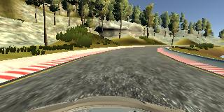
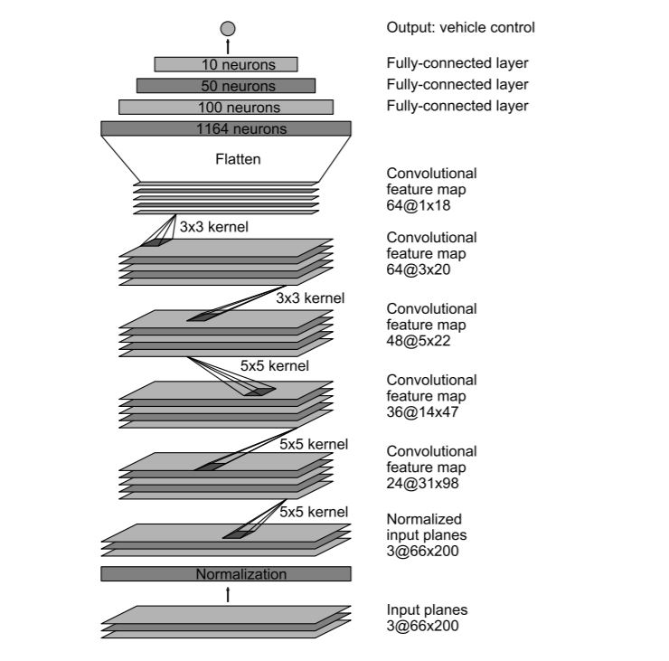
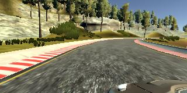
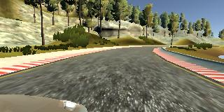

# **Behavioral Cloning** 

The objective of the project is to develop a system and algorithm with which  car drives through a path in a simulator in autonomous mode without explicit programminng for the driving paths(lanes,road conditions etc.). The method employed is deep learning to achieve the project objectives. 



The process to develop such a system involves the following steps :  
* Use the simulator to collect data of good driving behavior
* Build, a convolution neural network in Keras that predicts steering angles from images
* Train and validate the model with a training and validation set
* Test that the model successfully drives around track one without leaving the road
* Summarize the results with a written report

### Files Submitted & Code Quality

#### 1. Submission includes all required files and can be used to run the simulator in autonomous mode
The below required files are available in the root :
* model.py file - Python source code of the project to train the model
* drive.py - Executes the algorithm in simulator
* model.h5 - Compiled model
* writeup report - Report having processes and steps
* video.mp4 - One complete lap video

#### 2. Submission includes functional code
The car can be driven in the simulator using the compiled model,trained using a deep neural network based on Nvidia End-End deep learning. The car can be driven in the Udacity provided Simulator by executing the below command : 

```
python drive.py model.h5
```

#### 3. Submission code is usable and readable
The code is readable having appropriate sections for specific tasks which are self-explanatory and easy to understand.  The code was developed in python using Udacity project workspace. The model was trained and verified using GPU. 

The below packages were used to develop code : 
```
import csv
import numpy as np
import cv2
from tqdm import tqdm 
import keras
from keras.models import Sequential
from keras.layers.core import Dense, Flatten, Activation, Dropout
from keras.layers.convolutional import Convolution2D
from keras.layers import Lambda, Cropping2D
```

### Model Architecture and Training Strategy

#### 1. An appropriate model architecture has been employed

During the project , two models were tested namely Lenet and Nvidia end-end deep learning. For simple scenarios like straight driving, easy turns LeNet performed well but for difficult scenarios like steep turns (after the bridge) the model failed to predict correct sterring angle values. Therefor,Nvidia model was tried and tested for such scenarios. The results obtained were good.



The model performed well for the project data but was failing in certain scenarios for which regularization was added.

#### 2. Attempts to reduce overfitting in the model

Regularization was needed to reduce overfitting the model and to perform well for the testing scenarios. Drop out layers were introduced in the model to reduce overfitting. Multiple eperiements were conducted to arrive at the correct dropout layer position and frequency.
Finally, one drop out layer worked well for this project.(model.py line 98)

#### 3. Model parameter tuning

The model used an adam optimizer, so the learning rate was not tuned manually (model.py line 116). I tested the model with epoch sizes in the range from 2-10. The epoch size of 5 worked well.

#### 4. Appropriate training data

Udacity provided training data was used to train the model The provided training data was analysed. It had a total of 24,108 images from center,left and right cameras. The training data had a total of 8 laps : 4 clockwise and 4 anti-colckwise. 

### Model Architecture and Training Strategy

#### 1. Solution Design Approach

The final model architecture was derived at by experimenting and checking different models. Previous results proved that Lenet worked well for identifying patterns in images and hence this model was used a base and to test different scenarios. However, as the scenes were complex , a much deeper and complex model was needed to achieve project objective, Therefore, Nvidia model was used as a base to develop model for this project. 

In order to gauge how well the model was working, I split my image and steering angle data into a training and validation set. I found that my first model had a low mean squared error on the training set but a high mean squared error on the validation set. This implied that the model was overfitting. To reduce ovefitting, drop out layer was added in the model. 
Due to good amount and quality of provided training data, additional data was not needed to train the model. 

The final step was to run the simulator to see how well the car was driving around track one. There were a few spots where the vehicle fell off the track. To start with ,**three drop out layers** were added to generalise the model but it was not giving desired results.Eventually, dropout layers were reduced to **one** with a **rate of 0.2**.  

At the end of the process, the vehicle is able to drive autonomously around the track without leaving the road.

#### 2. Final Model Architecture

The final model architecture (model.py lines 18-24) is based on Nvidia architecture with some customization as mentioned below :

* Image normalization - using Keras lambda layer
* Image Cropping - using Keras Cropping2D layer
* Convolution: 5x5, filter: 24, strides: 2x2, activation: ELU
* Dropout (0.2)
* Convolution: 5x5, filter: 36, strides: 2x2, activation: ELU
* Convolution: 5x5, filter: 48, strides: 2x2, activation: ELU
* Convolution: 3x3, filter: 64, strides: 1x1, activation: ELU
* Convolution: 3x3, filter: 64, strides: 1x1, activation: ELU
* Flattening
* Fully connected: neurons: 100, activation: ELU
* Fully connected: neurons: 50, activation: ELU
* Fully connected: neurons: 10, activation: ELU
* Fully connected: neurons: 1 (output)


#### 3. Creation of the Training Set & Training Process

Udacity provided training data was used to train model.The provided training data was analysed to understand the coverage of scenarios for training the model. The provided data was of good quality and high in number. 

      

The training data had images from a total of eight laps. Recordings were done in such a way that 4 laps were recorded in clockwise direction and other 4 were in anti-clockwise direction. This ensured that trainig data is being trained for both directions and generalises/learns parameters in a better fashion. 

Through debugging and experiements, following observations were noted :
* Quality of data with diverse scenarios is more important than the number of data.
* Deep neural network need large number of data (with less bias) for correct predictions.
* Regularization techniques like dropout layers etc. should be done optimally and carefully else it leads to non-generalised model. 
* Selecting ROI though image cropping should be done correctly as the cropped data is used to find patterns and is used for trainings/predictions.  
